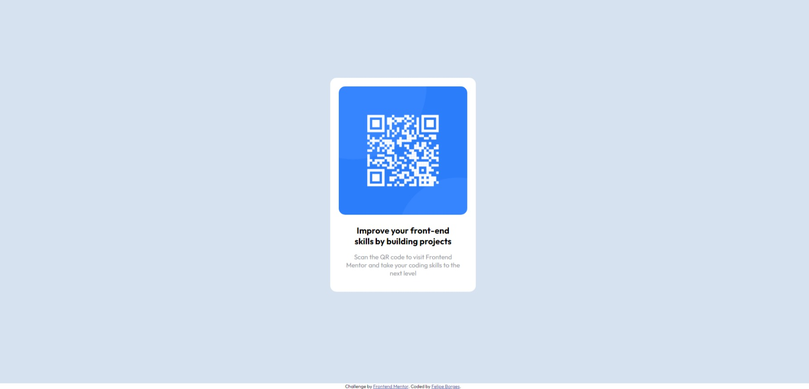

# Frontend Mentor - QR code component solution

This is a solution to the [QR code component challenge on Frontend Mentor](https://www.frontendmentor.io/challenges/qr-code-component-iux_sIO_H). Frontend Mentor challenges help you improve your coding skills by building realistic projects. 

## Table of contents

- [Overview](#overview)
  - [Screenshot](#screenshot)
  - [Links](#links)
- [My process](#my-process)
  - [Built with](#built-with)
  - [Useful resources](#useful-resources)
- [Author](#author)

## Overview

### Screenshot

### Links

- Solution URL: [QRCode Component](https://devfborges.github.io/qrcode-component/)

## My process

### Built with

- HTML5
- CSS custom properties
- Flexbox

### Useful resources

- [A Complete Guide to Flexbox](https://css-tricks.com/snippets/css/a-guide-to-flexbox/) - This is an amazing article which helped me finally understand Flexbox. I'd recommend it to anyone still learning this concept, because it has a complete guide with the main tools of flexbox.

## Author

- Website - [Felipe Borges](https://github.com/FelipeBorge5)
- Frontend Mentor - [@FelipeBorge5](https://www.frontendmentor.io/profile/FelipeBorge5)
- LinkedIn - [@devfelipeborges](https://www.linkedin.com/in/devfelipeborges/)
